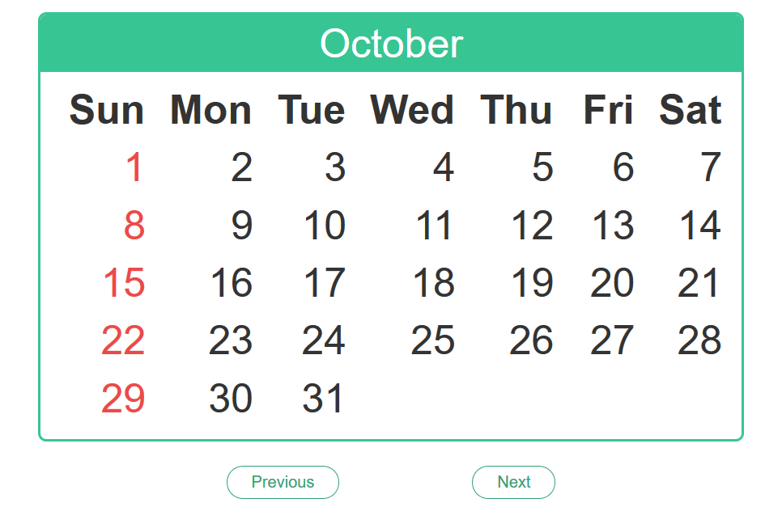

# Phalendar

A calendar application built with PHP and HTML5.

## Screenshot

## Prerequisites

- A PHP Server (like [Apache](https://www.apache.org/) or something)
- A browser to see results

## Running

To run this project in your machine, just clone the repository and start the PHP server on the directory.

## Built With

* [PHP](https://secure.php.net/) - A web programming language
* [HTML5](https://www.w3schools.com/html/html5_intro.asp) - The markup of the web
* [Apache](https://httpd.apache.org/) - A open web server
## Authors

* **Nathanel** - *For a while* - [nathabonfim59](https://github.com/nathabonfim59)

## License

This project is licensed under the MIT License - see the [LICENSE.md](LICENSE.md) file for details

## Acknowledgments

* Special thanks to [Evaldo Junior](https://github.com/InFog) for suggest this project in the book **Desenvolvimento web com PHP e MySQL** from [Casa do Código](https://github.com/casadocodigo).
